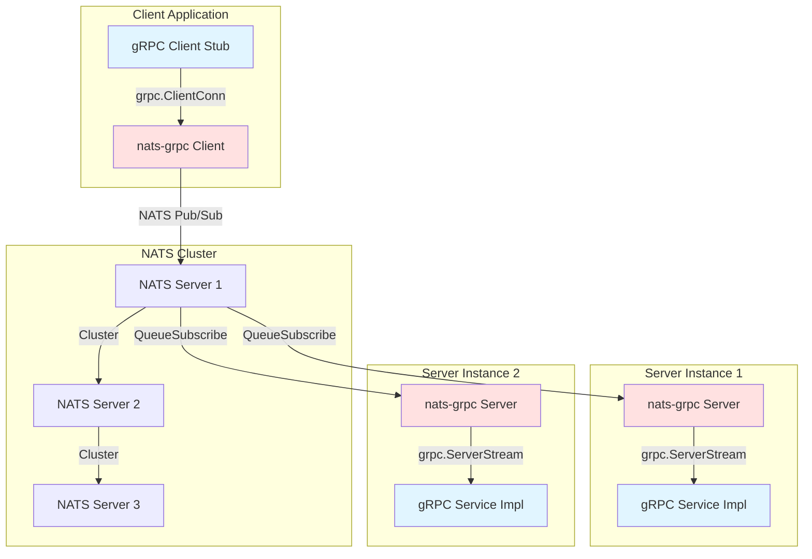
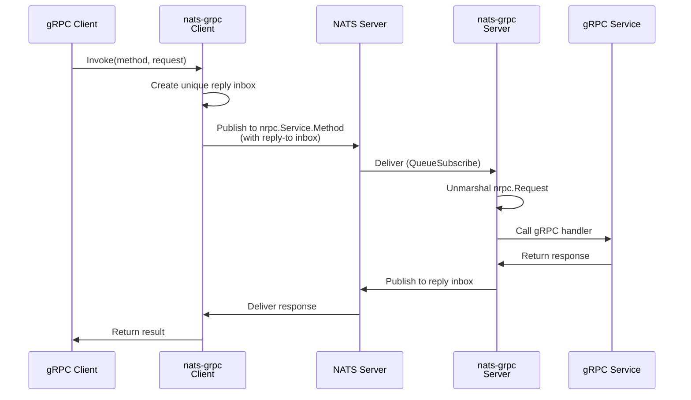
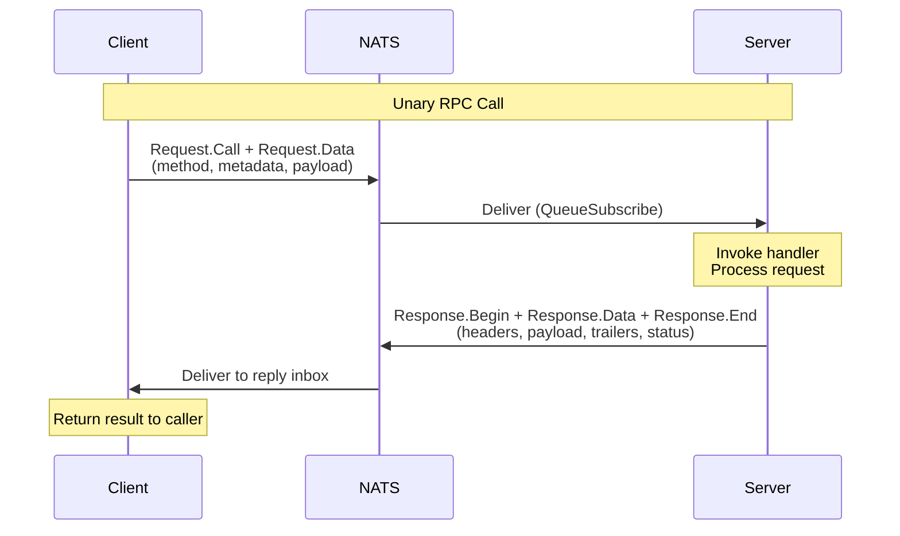
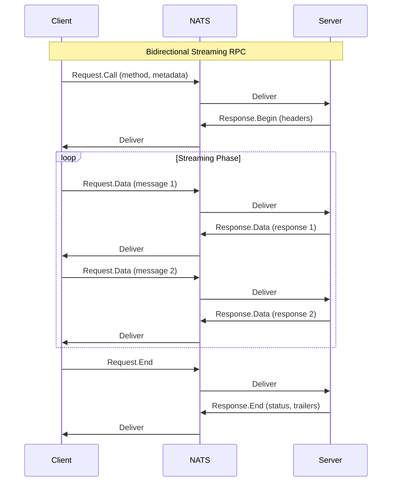
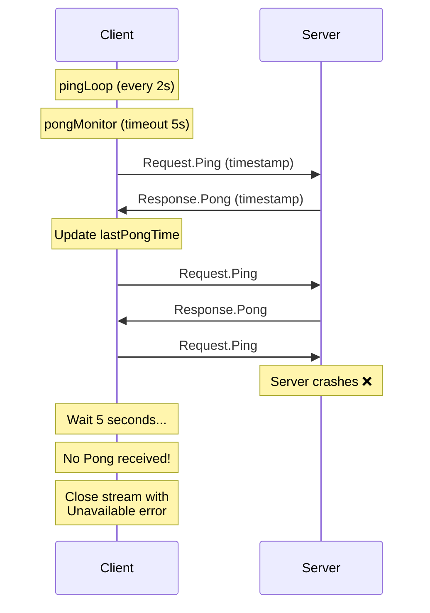
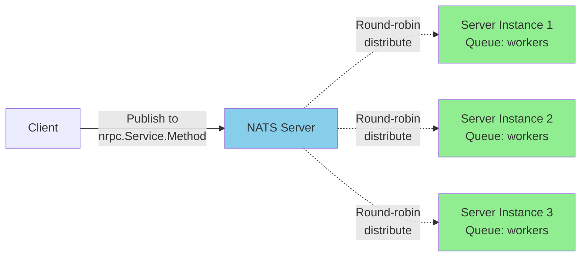
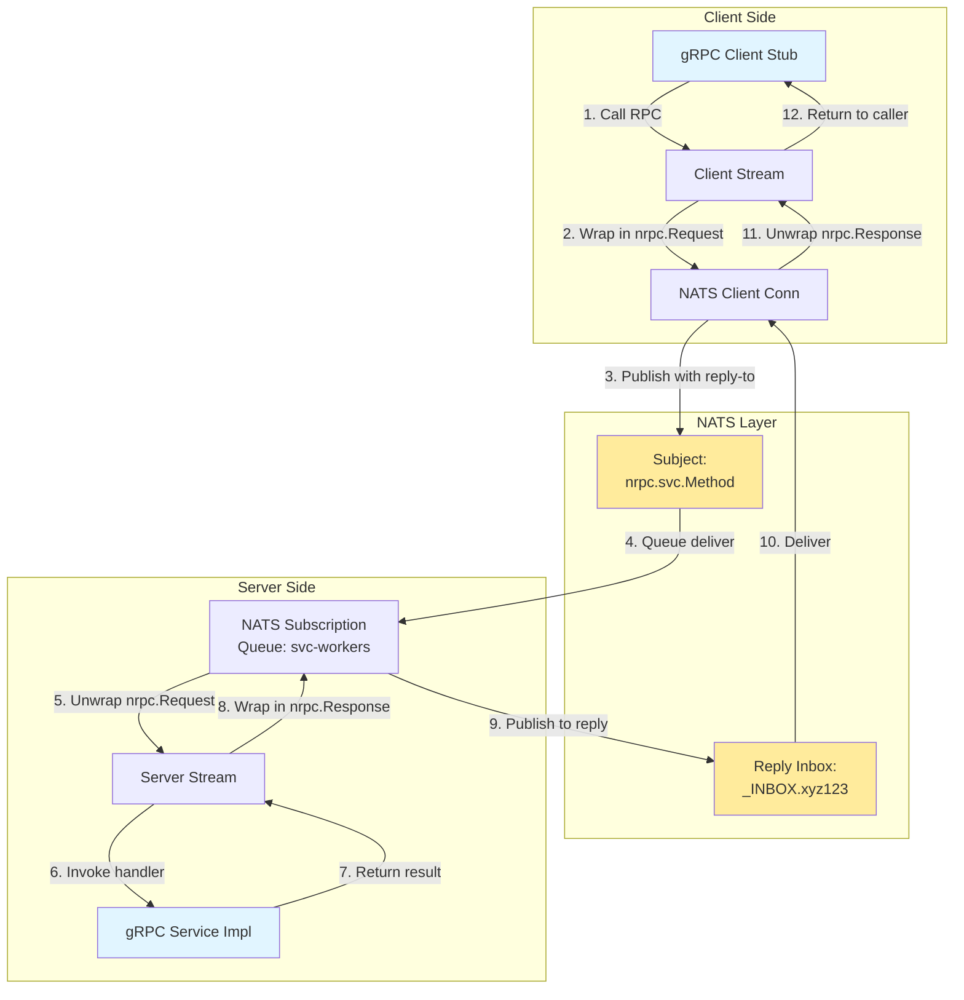

# nats-grpc

**gRPC over NATS**: A generic gRPC transport layer implementation using NATS messaging system instead of HTTP/2.

## Overview

nats-grpc enables gRPC services to communicate over NATS message queue instead of the traditional HTTP/2 transport. This provides several advantages including built-in load balancing, service discovery, fault tolerance, and the ability to work across network boundaries where HTTP/2 might be restricted.

## Features

* ✅ **Full gRPC Support**: Unary, Client-Streaming, Server-Streaming, and Bidirectional Streaming
* ✅ **NATS QueueSubscribe**: Built-in load balancing across service instances
* ✅ **Metadata Support**: Complete support for gRPC metadata (headers/trailers)
* ✅ **Service Discovery**: Unique service IDs for routing
* ✅ **Heartbeat Monitoring**: Automatic detection of server failures during streaming (3-6 second detection)
* ✅ **Standard gRPC API**: Compatible with existing gRPC code and tools
* ✅ **Reflection Support**: gRPC server reflection for dynamic service discovery

## Architecture

### High-Level Design



### How It Uses NATS as gRPC Transport

#### 1. Subject Mapping

Each gRPC service and method is mapped to a NATS subject:

```
Subject Format: nrpc[.service-id].package.Service.Method
Example: nrpc.user-svc.auth.AuthService.Login
```

**Subject Components:**
- `nrpc`: Protocol prefix
- `service-id`: Optional unique identifier for service instances (enables routing)
- Package/Service/Method: From the gRPC service definition

#### 2. Request/Response Flow



#### 3. Protocol Messages

The `nrpc` protocol wraps gRPC messages in Protocol Buffer envelopes:

```protobuf
// Request messages (Client → Server)
message Request {
  oneof type {
    Call call = 2;     // Initiates RPC with method & metadata
    Data data = 3;     // Streaming data payload
    End end = 4;       // Closes stream
    Ping ping = 5;     // Heartbeat keepalive
  }
}

// Response messages (Server → Client)
message Response {
  oneof type {
    Begin begin = 2;   // Starts response with metadata
    Data data = 3;     // Streaming data payload
    End end = 4;       // Closes stream with status
    Pong pong = 5;     // Heartbeat acknowledgment
  }
}
```

#### 4. Unary RPC Implementation

Unary RPCs (single request, single response) are the simplest form of gRPC call. They follow a straightforward request-reply pattern over NATS:



**Message Flow for Unary RPC:**

1. **Client sends:**
   - `Request.Call`: Contains method name, metadata (headers)
   - `Request.Data`: Contains the protobuf-serialized request message
   - Both messages sent to the service subject (e.g., `nrpc.auth.AuthService.Login`)

2. **Server responds:**
   - `Response.Begin`: Contains response metadata (headers) and server node ID
   - `Response.Data`: Contains the protobuf-serialized response message
   - `Response.End`: Contains status code, error message (if any), and trailers
   - All messages sent to the client's unique reply inbox

3. **Client receives:**
   - Waits for all three response messages
   - Unmarshals the response payload
   - Returns result or error to the caller

**Key Characteristics:**

- **Single request/response**: Unlike streaming, only one request and one response message
- **Synchronous**: Client blocks waiting for the response
- **Timeout handling**: Uses context deadlines for request timeout
- **Load balanced**: NATS QueueSubscribe distributes requests across server instances
- **Stateless**: No long-lived connection or stream state maintained

**Example Protocol Sequence:**

```
Client → NATS: nrpc.auth.Login
  Request.Call {method: "/auth.AuthService/Login", metadata: {}}
  Request.Data {data: <serialized LoginRequest>}

Server → NATS: _INBOX.client123
  Response.Begin {headers: {}, nid: "server-1"}
  Response.Data {data: <serialized LoginResponse>}
  Response.End {status: {code: 0, message: "OK"}, trailer: {}}
```

**Performance Considerations:**

- Minimal overhead: Only 2 request messages + 3 response messages
- Fast path: No stream setup or teardown
- Efficient: Leverages NATS's optimized request-reply pattern
- Low latency: Direct subject-to-inbox delivery

#### 5. Streaming Implementation

Streaming RPCs are implemented by sending multiple messages over the same NATS subjects:



#### 5. Heartbeat Mechanism

To detect server failures during streaming, a heartbeat protocol is implemented:



**Detection Time**: 3-6 seconds after server failure

### Load Balancing with NATS QueueSubscribe

NATS provides built-in load balancing through queue groups:



**How it works:**
1. Multiple server instances subscribe to the same subject with a queue group name
2. NATS automatically distributes requests across instances (round-robin)
3. Each request is delivered to exactly one server instance
4. If a server fails, NATS stops sending requests to it

### Complete Data Flow Architecture



## Usage

### Server Example

```go
package main

import (
	"context"
	"log"
	
	"github.com/cloudwebrtc/nats-grpc/pkg/rpc"
	pb "github.com/example/proto"
	"github.com/nats-io/nats.go"
)

type myService struct {
	pb.UnimplementedMyServiceServer
}

func (s *myService) SayHello(ctx context.Context, req *pb.HelloRequest) (*pb.HelloReply, error) {
	return &pb.HelloReply{Message: "Hello " + req.Name}, nil
}

func main() {
	// Connect to NATS
	nc, _ := nats.Connect(nats.DefaultURL)
	defer nc.Close()
	
	// Create nats-grpc server with service ID
	server := rpc.NewServer(nc, "my-service-v1")
	
	// Register gRPC service
	pb.RegisterMyServiceServer(server, &myService{})
	
	// Server runs until interrupted
	select {}
}
```

### Client Example

```go
package main

import (
	"context"
	"log"
	
	"github.com/cloudwebrtc/nats-grpc/pkg/rpc"
	pb "github.com/example/proto"
	"github.com/nats-io/nats.go"
)

func main() {
	// Connect to NATS
	nc, _ := nats.Connect(nats.DefaultURL)
	defer nc.Close()
	
	// Create nats-grpc client
	client := rpc.NewClient(nc, "my-service-v1", "client-1")
	defer client.Close()
	
	// Create gRPC client stub
	stub := pb.NewMyServiceClient(client)
	
	// Make RPC call
	resp, err := stub.SayHello(context.Background(), &pb.HelloRequest{Name: "World"})
	if err != nil {
		log.Fatal(err)
	}
	
	log.Printf("Response: %s", resp.Message)
}
```

## Key Benefits

### vs. Traditional gRPC (HTTP/2)

| Feature | nats-grpc | Standard gRPC |
|---------|-----------|---------------|
| **Load Balancing** | Built-in (NATS queue groups) | Requires external LB |
| **Service Discovery** | Built-in (NATS subjects) | Requires external service |
| **Fault Tolerance** | Automatic failover | Requires retry logic |
| **Network Boundaries** | Works across NAT/firewalls | Often blocked |
| **Deployment** | No additional infrastructure | Requires LB/service mesh |
| **Multi-tenancy** | Service IDs for isolation | Complex routing |

### Use Cases

1. **Microservices in Cloud**: Replace service mesh with NATS for simpler deployment
2. **IoT/Edge Computing**: Connect devices behind NAT without VPN
3. **Hybrid Cloud**: Seamless communication across cloud providers
4. **Multi-region**: NATS clustering provides geographic distribution
5. **Development**: No need for complex load balancer setup

## Advanced Features

### Service ID Routing

Route requests to specific service versions or instances:

```go
// Server with version ID
server := rpc.NewServer(nc, "auth-service-v2")

// Client targeting specific version
client := rpc.NewClient(nc, "auth-service-v2", "web-app")
```

### Heartbeat Monitoring

Automatic detection of server failures during streaming (see [HEARTBEAT.md](./HEARTBEAT.md)):

- Client sends Ping every 2 seconds
- Server responds with Pong immediately
- Client detects failure if no Pong within 5 seconds
- Detection time: 3-6 seconds

### gRPC Reflection

Server reflection allows dynamic service discovery:

```go
import "github.com/cloudwebrtc/nats-grpc/pkg/rpc/reflection"

server := rpc.NewServer(nc, "my-service")
reflection.Register(server) // Enable reflection
```

## Examples

See the `examples/` directory for complete working examples:

- **[echo](./examples/echo/)**: Basic unary and streaming RPC
- **[heartbeat](./examples/heartbeat/)**: Server failure detection demo
- **[metadata](./examples/metadata/)**: Working with gRPC metadata
- **[reflection](./examples/reflection/)**: Using gRPC server reflection

## Requirements

- Go 1.20 or later
- NATS Server 2.x
- Protocol Buffers compiler (protoc)

## Installation

```bash
go get github.com/cloudwebrtc/nats-grpc
```

## Building

```bash
# Install dependencies
go mod download

# Generate protobuf code
./proto.sh

# Run tests
go test ./...

# Build examples
go build ./examples/echo/server
go build ./examples/echo/client
```

## Documentation

- [Heartbeat Implementation](./HEARTBEAT.md) - Detailed docs on failure detection
- [Examples](./examples/) - Working code samples
- [Protocol Definition](./protos/nrpc/nrpc.proto) - nrpc protocol specification

## License

MIT License - see [LICENSE](./LICENSE) file for details

## Contributing

Contributions are welcome! Please feel free to submit issues and pull requests.
