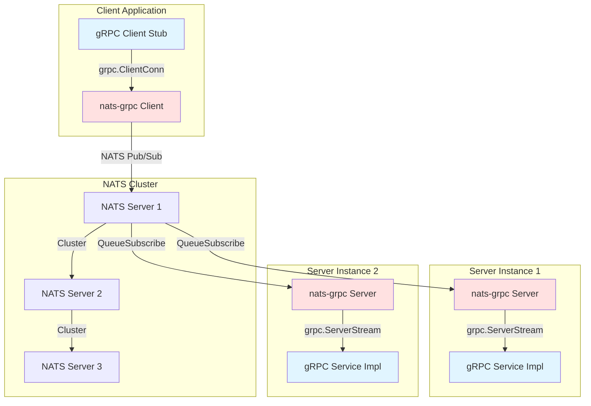
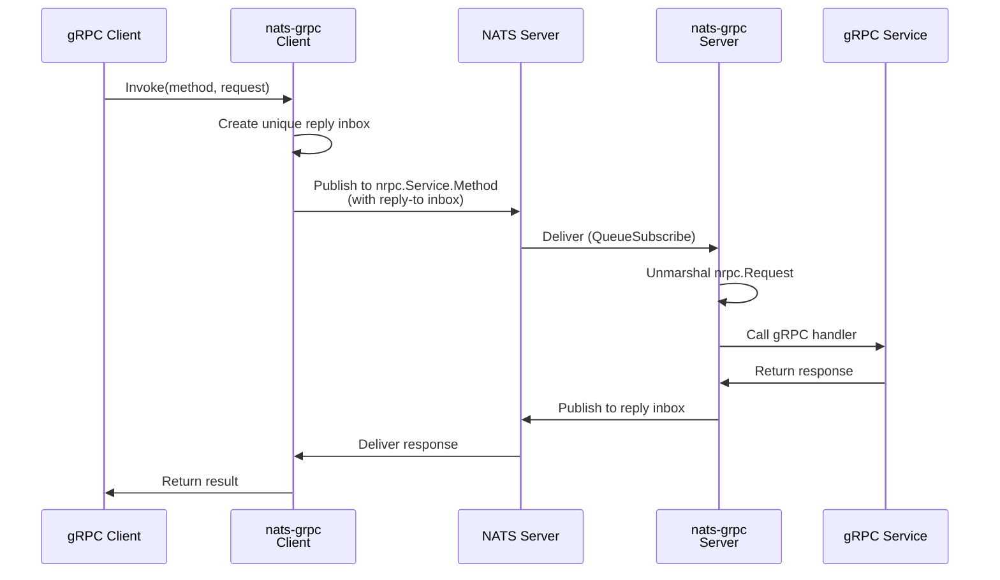
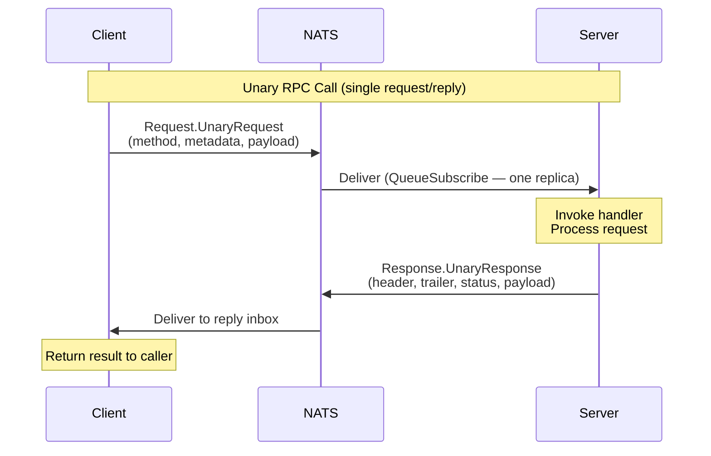
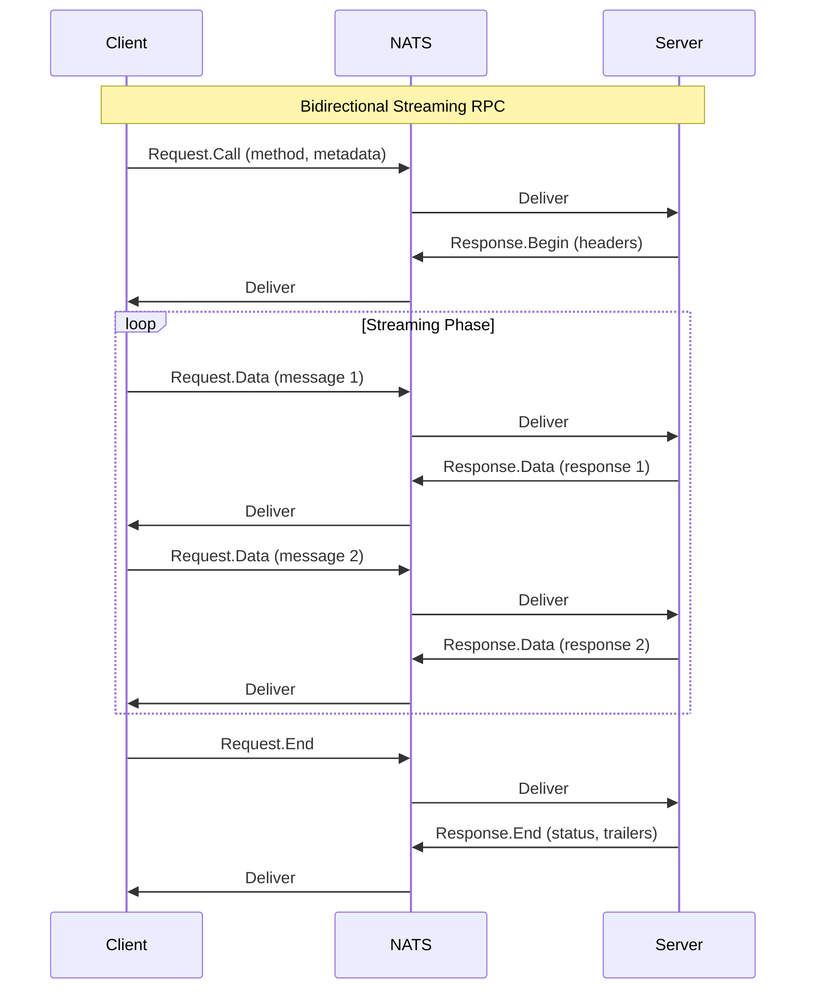
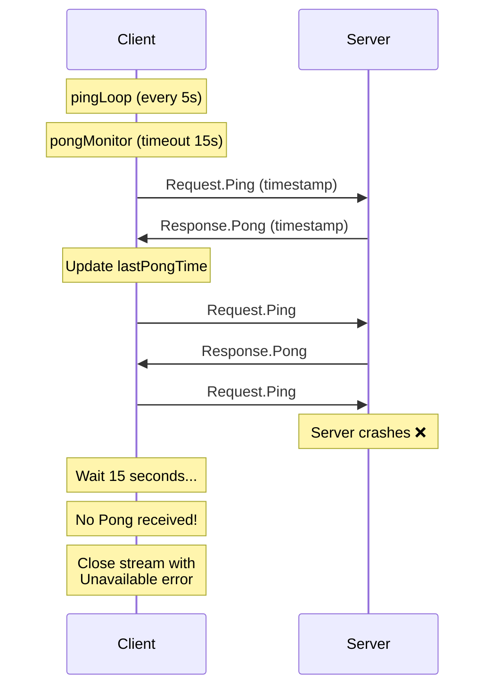
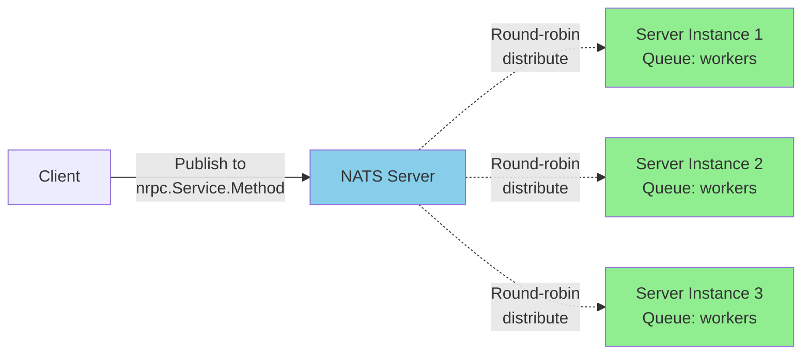
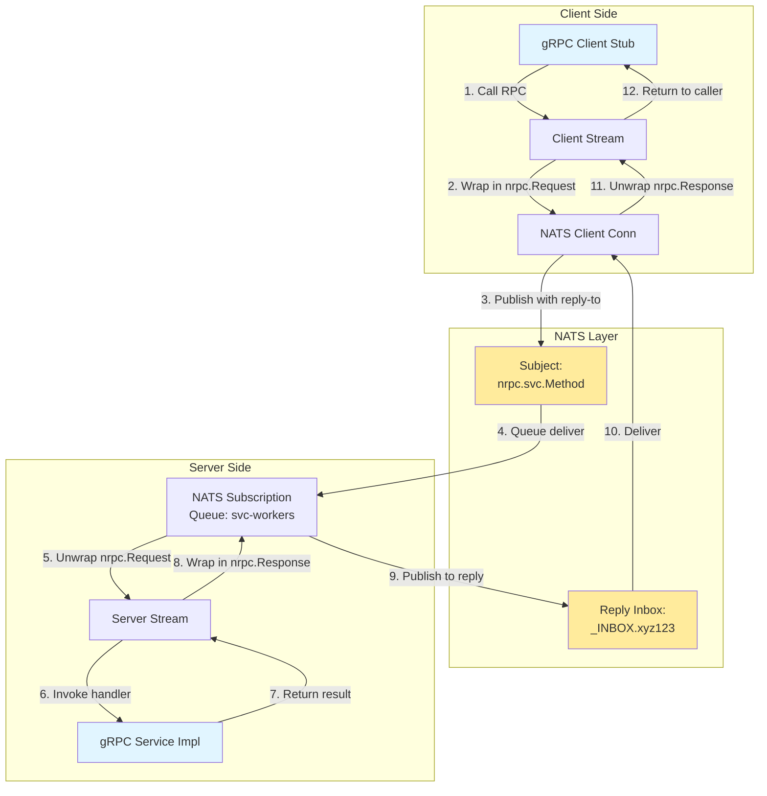

# nats-grpc

**gRPC over NATS**: A generic gRPC transport layer implementation using NATS messaging system instead of HTTP/2.

## Overview

nats-grpc enables gRPC services to communicate over NATS message queue instead of the traditional HTTP/2 transport. This provides several advantages including built-in load balancing, service discovery, fault tolerance, and the ability to work across network boundaries where HTTP/2 might be restricted.

## Features

* ✅ **Full gRPC Support**: Unary, Client-Streaming, Server-Streaming, and Bidirectional Streaming
* ✅ **Load-Balanced Unary RPCs**: Single-message NATS request/reply — safe to fan out across replicas via queue groups
* ✅ **Metadata Support**: Complete support for gRPC metadata (headers/trailers)
* ✅ **Service Discovery**: Unique service IDs for routing
* ✅ **Heartbeat Monitoring**: Automatic detection of server failures during streaming RPCs (10–15s detection)
* ✅ **Stats Handler Integration**: `WithStatsHandler` / `WithServerStatsHandler` accept any `google.golang.org/grpc/stats.Handler` — works with `otelgrpc` (metrics, traces) and any other handler that targets the standard interface
* ✅ **Standard gRPC API**: Compatible with existing gRPC code and tools
* ✅ **Reflection Support**: gRPC server reflection for dynamic service discovery

## Architecture

### High-Level Design



### How It Uses NATS as gRPC Transport

#### 1. Subject Mapping

Each gRPC service and method is mapped to a NATS subject:

```
Subject Format: nrpc[.service-id].package.Service.Method
Example: nrpc.user-svc.auth.AuthService.Login
```

**Subject Components:**
- `nrpc`: Protocol prefix
- `service-id`: Optional unique identifier for service instances (enables routing)
- Package/Service/Method: From the gRPC service definition

#### 2. Request/Response Flow



#### 3. Protocol Messages

The `nrpc` protocol wraps gRPC messages in Protocol Buffer envelopes. Unary
RPCs use the `UnaryRequest` / `UnaryResponse` variants (single message in,
single message out via NATS request/reply); streaming RPCs use the
`Call`/`Data`/`End` framing:

```protobuf
// Request messages (Client → Server)
message Request {
  oneof type {
    Call         call  = 2;  // Streaming: initiates RPC with method & metadata
    Data         data  = 3;  // Streaming: data payload
    End          end   = 4;  // Streaming: closes stream
    Ping         ping  = 5;  // Streaming: heartbeat keepalive
    UnaryRequest unary = 6;  // Unary: one-shot request (method + metadata + data)
  }
}

// Response messages (Server → Client)
message Response {
  oneof type {
    Begin         begin = 2;  // Streaming: starts response with metadata
    Data          data  = 3;  // Streaming: data payload
    End           end   = 4;  // Streaming: closes stream with status
    Pong          pong  = 5;  // Streaming: heartbeat acknowledgment
    UnaryResponse unary = 6;  // Unary: one-shot reply (header + trailer + status + data)
  }
}
```

#### 4. Unary RPC Implementation

Unary RPCs use NATS's native request/reply pattern under the hood
(`nc.RequestWithContext`): **one publish, one reply**. The entire RPC —
method, metadata, payload — is bundled into a single `UnaryRequest`, and the
server replies with a single `UnaryResponse`. This makes queue-group load
balancing across server replicas safe by construction: there is no second
message that could land on a different replica.



**Message Flow for Unary RPC:**

1. **Client sends one message** to the service subject (e.g.
   `nrpc.auth.AuthService.Login`):
   - `Request.UnaryRequest { method, metadata, data }`
   - Dispatch uses `nc.RequestWithContext`, so a unique reply inbox is set up
     and torn down automatically — no per-call NATS subscription churn.

2. **Server replies with one message** on the client's reply inbox:
   - `Response.UnaryResponse { header, trailer, status, data }`
   - `status` carries the gRPC code/message (OK for success, otherwise the
     handler error).

3. **Client receives one message** and:
   - Populates any `grpc.Header(&md)` / `grpc.Trailer(&md)` call options.
   - If `status` is non-OK, returns it as a gRPC `status.Error`.
   - Otherwise unmarshals `data` into the response proto.

**Key Characteristics:**

- **Single request/response**: One NATS publish each way.
- **Safe load balancing**: Multiple servers can share a queue group; every
  RPC lands on exactly one replica.
- **No per-call subscription**: NATS's shared inbox is reused for all unary
  calls on the connection — high RPS doesn't churn subscriptions.
- **Synchronous**: Client blocks waiting for the response; context deadlines
  drive timeouts (`context.DeadlineExceeded` → `codes.DeadlineExceeded`).
- **Failure mapping**: `nats.ErrNoResponders` → `codes.Unavailable`.

**Example Protocol Sequence:**

```
Client → NATS: nrpc.auth.AuthService.Login
  Request.UnaryRequest {
    method:   "/auth.AuthService/Login"
    metadata: {...}
    data:     <serialized LoginRequest>
  }

Server → NATS: _INBOX.<client-conn>.<rand>
  Response.UnaryResponse {
    header:  {...}
    trailer: {...}
    status:  { code: 0, message: "OK" }
    data:    <serialized LoginResponse>
  }
```

**Performance Considerations:**

- Minimal overhead: 1 request + 1 reply on the wire.
- No stream setup/teardown, no heartbeat goroutines per call.
- Efficient: leverages NATS's optimized request/reply path with a shared
  per-connection inbox subscription.

#### 5. Streaming Implementation

Streaming RPCs are implemented by sending multiple messages over the same NATS subjects:



#### 5. Heartbeat Mechanism

To detect server failures during **streaming** RPCs, a heartbeat protocol is
implemented. (Unary RPCs do not use the heartbeat — they rely on the
`nc.RequestWithContext` deadline; `nats.ErrNoResponders` surfaces as
`codes.Unavailable` instantly.) Streaming requires a non-empty `nid`
(point-to-point addressing) so that Ping/Pong reaches the same replica that
owns the stream — see [HEARTBEAT.md](./HEARTBEAT.md) for details.



**Detection Time**: 10–15 seconds after server failure

### Load Balancing with NATS QueueSubscribe

NATS provides built-in load balancing through queue groups:



**How it works:**
1. Multiple server instances subscribe to the same subject with a queue group name.
2. NATS distributes each message in the queue group to exactly one subscriber.
3. If a server fails, NATS stops sending requests to it.

**Safety note — unary vs. streaming under load balancing:**

- **Unary RPCs are safe to load-balance** across multiple replicas sharing the
  same `nid`. Because the whole RPC is a single request/reply message pair,
  the call always lands on exactly one replica.
- **Streaming RPCs cannot be load-balanced.** They span multiple messages
  (`Call`, `Data`, `End`, ...) that must reach the same replica to preserve
  stream state. Use a unique `nid` per streaming server so the subject is
  point-to-point and no queue-group fan-out occurs.

### Complete Data Flow Architecture



## Usage

### Server Example

```go
package main

import (
	"context"
	"log"
	
	"github.com/cloudwebrtc/nats-grpc/pkg/rpc"
	pb "github.com/example/proto"
	"github.com/nats-io/nats.go"
)

type myService struct {
	pb.UnimplementedMyServiceServer
}

func (s *myService) SayHello(ctx context.Context, req *pb.HelloRequest) (*pb.HelloReply, error) {
	return &pb.HelloReply{Message: "Hello " + req.Name}, nil
}

func main() {
	// Connect to NATS
	nc, _ := nats.Connect(nats.DefaultURL)
	defer nc.Close()
	
	// Create nats-grpc server with service ID
	server := rpc.NewServer(nc, "my-service-v1")
	
	// Register gRPC service
	pb.RegisterMyServiceServer(server, &myService{})
	
	// Server runs until interrupted
	select {}
}
```

### Client Example

```go
package main

import (
	"context"
	"log"
	
	"github.com/cloudwebrtc/nats-grpc/pkg/rpc"
	pb "github.com/example/proto"
	"github.com/nats-io/nats.go"
)

func main() {
	// Connect to NATS
	nc, _ := nats.Connect(nats.DefaultURL)
	defer nc.Close()
	
	// Create nats-grpc client
	client := rpc.NewClient(nc, "my-service-v1", "client-1")
	defer client.Close()
	
	// Create gRPC client stub
	stub := pb.NewMyServiceClient(client)
	
	// Make RPC call
	resp, err := stub.SayHello(context.Background(), &pb.HelloRequest{Name: "World"})
	if err != nil {
		log.Fatal(err)
	}
	
	log.Printf("Response: %s", resp.Message)
}
```

## Key Benefits

### vs. Traditional gRPC (HTTP/2)

| Feature | nats-grpc | Standard gRPC |
|---------|-----------|---------------|
| **Load Balancing** | Built-in (NATS queue groups) | Requires external LB |
| **Service Discovery** | Built-in (NATS subjects) | Requires external service |
| **Fault Tolerance** | Automatic failover | Requires retry logic |
| **Network Boundaries** | Works across NAT/firewalls | Often blocked |
| **Deployment** | No additional infrastructure | Requires LB/service mesh |
| **Multi-tenancy** | Service IDs for isolation | Complex routing |

### Use Cases

1. **Microservices in Cloud**: Replace service mesh with NATS for simpler deployment
2. **IoT/Edge Computing**: Connect devices behind NAT without VPN
3. **Hybrid Cloud**: Seamless communication across cloud providers
4. **Multi-region**: NATS clustering provides geographic distribution
5. **Development**: No need for complex load balancer setup

## Advanced Features

### Service ID Routing

Route requests to specific service versions or instances:

```go
// Server with version ID
server := rpc.NewServer(nc, "auth-service-v2")

// Client targeting specific version
client := rpc.NewClient(nc, "auth-service-v2", "web-app")
```

### Heartbeat Monitoring

Automatic detection of server failures during **streaming** RPCs (see
[HEARTBEAT.md](./HEARTBEAT.md)). Unary RPCs do not use heartbeats — they
rely on the request/reply deadline.

- Client sends Ping every 5 seconds
- Server responds with Pong immediately
- Client detects failure if no Pong within 15 seconds
- Detection time: 10–15 seconds

### gRPC Reflection

Server reflection allows dynamic service discovery:

```go
import "github.com/cloudwebrtc/nats-grpc/pkg/rpc/reflection"

server := rpc.NewServer(nc, "my-service")
reflection.Register(server) // Enable reflection
```

### Observability — `stats.Handler` Integration

`pkg/rpc` invokes `google.golang.org/grpc/stats.Handler` callbacks at the
standard gRPC lifecycle points (`TagRPC`, `Begin`, `OutPayload`, `InPayload`,
`End`) for both unary and streaming RPCs, on both client and server. Anything
implementing `stats.Handler` plugs in — `otelgrpc`, custom histograms, audit
loggers, etc. — without `pkg/rpc` depending on any specific provider.

#### OpenTelemetry / `otelgrpc` (metrics + tracing)

```go
import (
    "go.opentelemetry.io/contrib/instrumentation/google.golang.org/grpc/otelgrpc"
    otelprom "go.opentelemetry.io/otel/exporters/prometheus"
    sdkmetric "go.opentelemetry.io/otel/sdk/metric"
)

// One-time setup: a MeterProvider whose metrics are exposed via the
// existing Prometheus /metrics endpoint.
exporter, _ := otelprom.New()
mp := sdkmetric.NewMeterProvider(sdkmetric.WithReader(exporter))
defer mp.Shutdown(context.Background())

// Server side.
srv := rpc.NewServerWithOptions(nc, "my-svc",
    rpc.WithServerStatsHandler(otelgrpc.NewServerHandler(otelgrpc.WithMeterProvider(mp))),
)

// Client side.
cli := rpc.NewClientWithOptions(nc, "my-svc", "client-1",
    rpc.WithStatsHandler(otelgrpc.NewClientHandler(otelgrpc.WithMeterProvider(mp))),
)
```

This produces `rpc.client.call.duration` and `rpc.server.call.duration`
histograms (plus request/response size metrics and gRPC spans if you also
configure a `TracerProvider`). The Prometheus exporter registers with
`prometheus.DefaultRegisterer`, so existing `promhttp.Handler()` scrape
endpoints automatically include the OTel metrics — no scrape config change
needed. See `examples/benchmark/{client,server}/main.go` for a complete
working setup.

#### Custom handler

```go
type latencyLogger struct{}

func (latencyLogger) TagRPC(ctx context.Context, info *stats.RPCTagInfo) context.Context {
    return context.WithValue(ctx, "begin", time.Now())
}
func (latencyLogger) HandleRPC(ctx context.Context, s stats.RPCStats) {
    if end, ok := s.(*stats.End); ok {
        log.Printf("rpc %s took %s err=%v", "?", end.EndTime.Sub(end.BeginTime), end.Error)
    }
}
func (latencyLogger) TagConn(ctx context.Context, _ *stats.ConnTagInfo) context.Context { return ctx }
func (latencyLogger) HandleConn(context.Context, stats.ConnStats)                        {}

srv := rpc.NewServerWithOptions(nc, "svc", rpc.WithServerStatsHandler(latencyLogger{}))
```

Multiple handlers can be registered — they fire in registration order at
each event, matching grpc-go's behavior.

## Examples

See the `examples/` directory for complete working examples:

- **[echo](./examples/echo/)**: Basic unary and streaming RPC
- **[heartbeat](./examples/heartbeat/)**: Server failure detection demo
- **[metadata](./examples/metadata/)**: Working with gRPC metadata
- **[reflection](./examples/reflection/)**: Using gRPC server reflection

## Requirements

- Go 1.26 or later
- NATS Server 2.x
- Protocol Buffers compiler (protoc)

## Installation

```bash
go get github.com/cloudwebrtc/nats-grpc
```

## Building

```bash
# Install dependencies
go mod download

# Generate protobuf code
./proto.sh

# Run tests
go test ./...

# Build examples
go build ./examples/echo/server
go build ./examples/echo/client
```

## Documentation

- [Heartbeat Implementation](./HEARTBEAT.md) - Detailed docs on failure detection
- [Examples](./examples/) - Working code samples
- [Protocol Definition](./protos/nrpc/nrpc.proto) - nrpc protocol specification

## License

MIT License - see [LICENSE](./LICENSE) file for details

## Contributing

Contributions are welcome! Please feel free to submit issues and pull requests.
